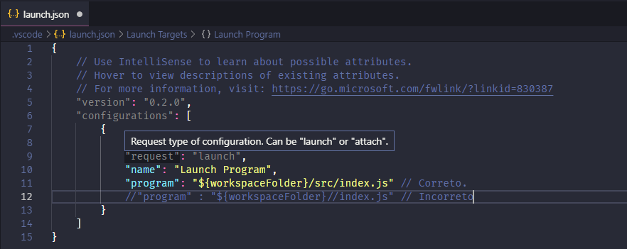

# API-Challenge

> API desenvolvida em Nodejs com JWT para autenticação e Geospatial para geolocalização.

## Versão com Geospatial Queries.

Essa versão da API utiliza Geospatial Queries.<br>
O calculo de geolocalização é feito dentro do MongoDB.


## Instalação

```sh
git clone https://github.com/ArielBetti/API-Challenge-Geospatial
```
Dentro do projeto de um npm install

```sh
npm install
```

## Como iniciar o projeto

Se você estiver utiizando o Visual Studio Code basta precionar a tecla **F5** dentro do projeto.<br>
Caso o Visual Studio Code reclame na execução provavelmente você terá que fazer uma alteração no arquivo **launch.json** dentro da sua pasta **.vscode**, assim como eu mostro na imagem a baixo.<br>



### Se preferir pode rodar em modo desenvolvimento

Confira se você possui o pacote **yarn** na sua máquina, presente no **package.json** desse projeto.

```sh
yarn dev
```

## Como utilizar essa API

#### Passo a passo
Essa API possui o pacote **JWT** sendo assim você precisa se autenticar primeiro na API, você pode fazer isso com o software que preferir, nesse exemplo estarei utiizando o **Insomnia**

#### Caso não tenha um usuário de acesso.
Caso você já tenha um usuário de acesso pule essa etapa.<br>
Esse serviço está rodando na porta **8080** então vamos utilizar a URL **localhost:8080/auth/register** e o tipo de requisição é um **POST**, por tanto escolha **JSON** no body para passar os Parâmetros, assim como na imagem a baixo.<br>


#### Autenticando na API
Utilize email e senha para se autenticar na API, esse serviço está rodando na porta **8080** então vamos utilizar a URL **localhost:8080/auth/login** e o tipo de requisição é um **POST**, por tanto escolha **JSON** no body para passar os Parâmetros, assim como na imagem a baixo.<br>

### Importante !
Perceba que junto aos dados do usuário retornou um **Token** copie ele pois vai precisar no próximo passo.

### Buscando um serviço
Para buscar um serviço você precisa estar autenticado na API, para isso passe o seu **Token** obtido no login.<br>
Essa rota possibilita que o cliente busque por um serviço de **OIL_CHANGE** ou **DRY_WASHING** dentro de um raio de **10 quilometros** passando latitude e longitude para API.<br>
Preste bastante atenção aos passos para que tudo de certo !<br>

#### 1º Configurando requisição
Primeiro vamos configurar o ***header*** da nossa requisição passando o ***Token*** para ela.<br>
Lembrando que o serviço está escutando na porta **8080** então vamos utilizar a **URL** **localhost:8080/auth/findpartner** e o tipo de requisição é **POST**<br>
O nome do **header** deve ter **Authorization** e o valor deve começar com a palavra **Bearer** seguida de um espaço com o **Token**, em alguns casos o seu software vai precisar que você deixe explicito o tipo da aplicação no header como é o caso do **Insomina** então adicione o um novo header com o nome **Content-Type** com o valor **application/json**.<br>
<br>

#### 2º Passando Parâmetros
Apôs configurar o seu ***header*** vamos configurar os seus parâmetros no **body** passando para ele **"availableServices"** que é o tipo de serviço que você procura podendo ser **OIL_CHANGE** ou **DRY_WASHING** ou até mesmo os dois, **lat** que é a sua latitude e **long** que é a sua longitude.
Tudo deve conter o formato **JSON** assim como eu represento na imagem a baixo.


### Pronto você utilizou com sucesso a minha API !

## Sobre

Criador: **Ariel Betti**<br>
Email: **ariel.betti@gmail.com**<br>

Distribuído sob a licença MIT. Veja `LICENSE` para mais informações.

## Como contribuir

1. Faça o _fork_ do projeto.
2. Crie uma _branch_ para sua modificação (`git checkout -b feature/fooBar`)
3. Faça o _commit_ (`git commit -am 'Add some fooBar'`)
4. _Push_ (`git push origin feature/fooBar`)
5. Crie um novo _Pull Request_
